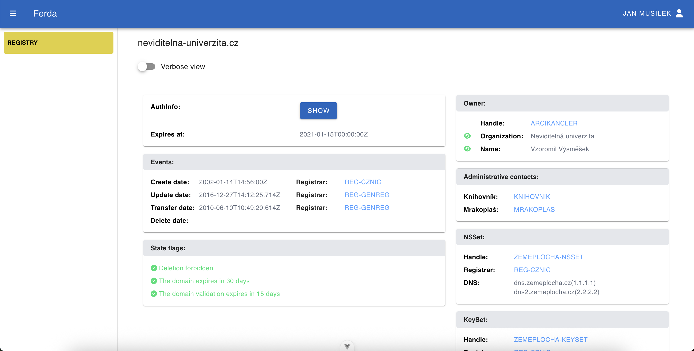

# Ferda

A simple project for displaying domain data. The data is fetched from a JSON file using Axios, and the information is displayed in individual cards. The app has 2 modes: brief and detailed. 

## Technologies
- Vue 3 (Composition API, script setup)
- Typescript
- Router
- Vuetify 
- FontAwesome icons
- Tailwind




## Project Setup

```sh
npm install
```

### Compile and Hot-Reload for Development

```sh
npm run dev
```

### Type-Check, Compile and Minify for Production

```sh
npm run build
```

### Lint with [ESLint](https://eslint.org/)

```sh
npm run lint
```
